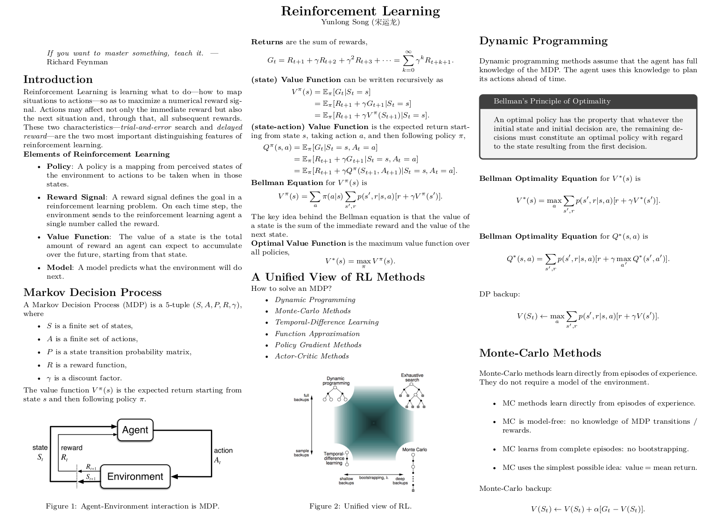

## Foundation of Robotics

As a self-taught robotics researcher, I have struggled to find the 
right resources to learn fundamental knowledge in robotics. This repository
is a collection of **Lecture Notes** I made while learning the foundation 
of robotics. I believe in the power of **learning by teaching** and **less is 
more**". Stay tuned for more updates. 

Disclaimer: The notes are not comprehensive and may contain errors.

### Overview

Robotics Basics
  - Linear Algebra
  - Calculus
  - Convex Optimization
  - Robot Dynamics

Control
  - Control Theory
  - Optimal Control
  - Numerical Optimal Control

Learning
  - Pattern Recognition and Machine Learning
  - Deep Learning
  - Reinforcement Learning

Vision
  - Vision Algorithms for Mobile Robotics
  - Deep Learning for Computer Vision

Estimation
  - Recursive Estimation

Case Study
  - Flying Robots
  - Legged Robots

### Example

