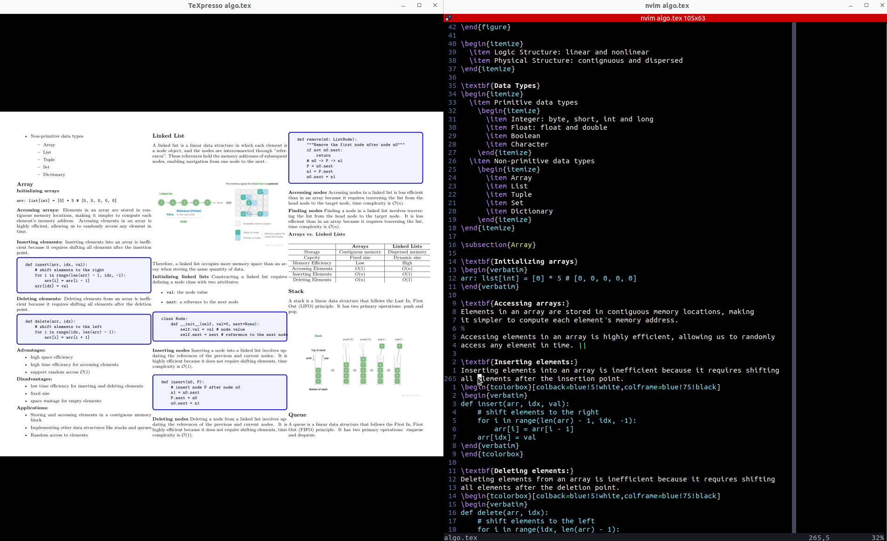

## How to Take Notes Using LaTeX 

### Overview
My note-taking setup is based on LaTeX and Neovim. I use LaTeX to write notes and Neovim as my text editor. I use the following plugins in Neovim:
- [coc.nvim](https://github.com/neoclide/coc.nvim): Intellisense engine for Neovim
- [vimtex](https://github.com/lervag/vimtex): A modern Vim and Neovim filetype plugin for LaTeX files
- [copilot-vim](https://github.com/github/copilot.vim): Copilot plugin for Neovim. Avoid typing tedious math equations, code snippets, latex syntax, symbols, text, and more.
- [texpresso.vim](https://github.com/let-def/texpresso.vim): A Vim plugin for 
  live rendering when editing LaTeX files (see the figure below) 

